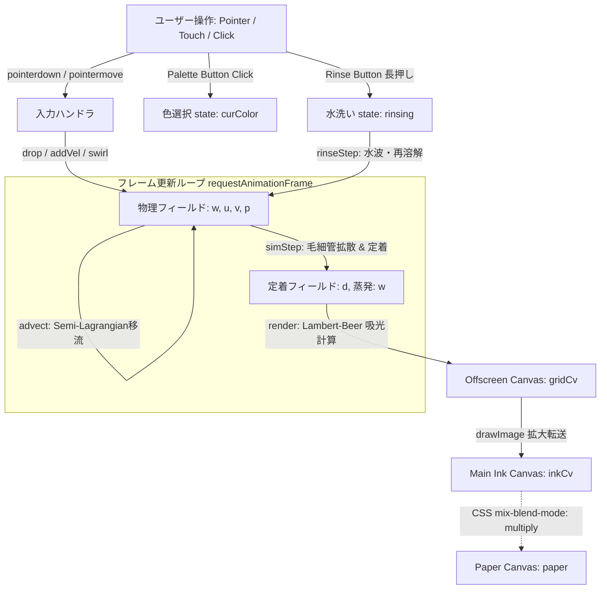

# 『墨戯 - BOKUGI』 システム設計書 (Design Specification)

本書は、インタラクティブ和紙・水墨画シミュレータWebアプリケーション『墨戯 - BOKUGI』の全体コード構造、物理計算モデル、描画パイプライン、UI/UX設計をリバースエンジニアリングし、体系的にまとめた設計書です。

---

## 1. 概要 (Overview)

### 1.1 プロジェクトコンセプト

『墨戯 - BOKUGI』は、ブラウザ上で和紙への落墨・にじみ・かすれ・流動・乾燥（定着）を物理シミュレーションによって再現する和風デジタルアート体験アプリケーションです。

### 1.2 構成ファイル一覧

| ファイル名 | 役割・概要 |
| :--- | :--- |
| [`index.html`](file:///Users/juna1013/bin/practice/BOKUGI/index.html) | DOM構造、キャンバス（和紙・墨層）、操作UI、TypeScript (`/src/main.ts`) 読み込み定義 |
| [`style.css`](file:///Users/juna1013/bin/practice/BOKUGI/style.css) | 縦書きタイポグラフィ、伝統色パレット、二層キャンバスの乗算合成（`mix-blend-mode`） |
| [`src/types/physics.ts`](file:///Users/juna1013/bin/practice/BOKUGI/src/types/physics.ts) | 伝統色インデックス (`ColorIndex = 0 \| 1 \| 2`)、吸光度ベクトル (`RGBColor`) 等の厳密型定義 |
| [`src/config.ts`](file:///Users/juna1013/bin/practice/BOKUGI/src/config.ts) | 物理パラメータ、格子定数、顔料の光学吸収係数（`ABS` as const）の定義 |
| [`src/physics/Noise.ts`](file:///Users/juna1013/bin/practice/BOKUGI/src/physics/Noise.ts) | 2D Value Noise 生成器および流体ノイズ演算関数 |
| [`src/physics/FluidGrid.ts`](file:///Users/juna1013/bin/practice/BOKUGI/src/physics/FluidGrid.ts) | 物理場データ構造クラス（`Float32Array`: 水分・速度・顔料濃度場）と格子管理 |
| [`src/physics/FluidSolver.ts`](file:///Users/juna1013/bin/practice/BOKUGI/src/physics/FluidSolver.ts) | 毛細血管拡散・定着・セミラグランジュ移流ソルバー（型安全な物理演算ロジック） |
| [`src/renderer/PaperRenderer.ts`](file:///Users/juna1013/bin/practice/BOKUGI/src/renderer/PaperRenderer.ts) | 和紙テクスチャ・繊維の静的キャンバス描画クラス |
| [`src/physics/WebGpuFluidSolver.ts`](file:///Users/juna1013/bin/practice/BOKUGI/src/physics/WebGpuFluidSolver.ts) | 同じ物理のコンピュートシェーダー実装。16×16 の 2D ワークグループと共有メモリタイル |
| [`src/renderer/InkRenderer.ts`](file:///Users/juna1013/bin/practice/BOKUGI/src/renderer/InkRenderer.ts) | Lambert-Beer減法混色計算と低解像度 Offscreen Canvas 転送描画クラス（Canvas 2D フォールバック） |
| [`src/renderer/WebGpuInkRenderer.ts`](file:///Users/juna1013/bin/practice/BOKUGI/src/renderer/WebGpuInkRenderer.ts) | 格子→テクスチャ→画素シェーディングの GPU 描画。作品カード用のオフスクリーン描画と読み戻し |
| [`src/quality/DeviceProfile.ts`](file:///Users/juna1013/bin/practice/BOKUGI/src/quality/DeviceProfile.ts) | WebGPU アダプター情報の読み出し、電話サイズ端末の判定 |
| [`src/quality/QualityPolicy.ts`](file:///Users/juna1013/bin/practice/BOKUGI/src/quality/QualityPolicy.ts) | セルサイズ・描画 DPR の初期値の決定 |
| [`src/quality/FrameBudgetMonitor.ts`](file:///Users/juna1013/bin/practice/BOKUGI/src/quality/FrameBudgetMonitor.ts) | 実フレーム間隔による描画 DPR とシェーディング段階の自動調整 |
| [`src/interaction/InputController.ts`](file:///Users/juna1013/bin/practice/BOKUGI/src/interaction/InputController.ts) | Pointer Capture・ポインター入力・ストローク運動量付与制御クラス |
| [`src/interaction/RinseController.ts`](file:///Users/juna1013/bin/practice/BOKUGI/src/interaction/RinseController.ts) | 水洗い機能の前線波・顔料再溶解アニメーション制御クラス |
| [`src/interaction/RinseEffects.ts`](file:///Users/juna1013/bin/practice/BOKUGI/src/interaction/RinseEffects.ts) | 洗い流すボタンのタンク水位・波・溢れ・前線の帯（`motion` による DOM 演出） |
| [`src/interaction/FlowController.ts`](file:///Users/juna1013/bin/practice/BOKUGI/src/interaction/FlowController.ts) | 流し書きの切り替え。入の間は紙に水を張って墨を一定の流れで運び、切にすると水を引かせる |
| [`src/main.ts`](file:///Users/juna1013/bin/practice/BOKUGI/src/main.ts) | アプリケーションのエントリポイント、全モジュールの初期化とメインループ (rAF) |
| [`tsconfig.json`](file:///Users/juna1013/bin/practice/BOKUGI/tsconfig.json) | TypeScript 設定 (`strict: true`, `noImplicitAny: true`, `strictNullChecks: true`) |
| [`docs/design.md`](file:///Users/juna1013/bin/practice/BOKUGI/docs/design.md) | 本設計ドキュメント |

---

## 2. 全体アーキテクチャ (System Architecture)

### 2.1 レイヤー構造とCanvas構成

本アプリケーションは、画面全体を覆う2枚の重なった `<canvas>` エレメントとUIオーバーレイで構成されています。

```bash
+-------------------------------------------------------+
|  UI Layer (z-index: 3)                                |
|  - タイトル (.title: "墨戯")                            |
|  - 伝統色パレット (.palette: 墨/朱/藍)                  |
|  - 水で洗い流すボタン (.rinse)                          |
+-------------------------------------------------------+
|  Hint Layer (z-index: 2)                              |
|  - 案内テキスト (.hint: "紙に触れてください")              |
+-------------------------------------------------------+
|  Ink Render Layer (z-index: 1, #inkLayer)             |
|  - mix-blend-mode: multiply                           |
|  - 物理シミュレーション結果（墨の挙動）のリアルタイム描画    |
+-------------------------------------------------------+
|  Paper Texture Layer (z-index: 0, #paper)             |
|  - 和紙のベース色、グラデーション、紙繊維ノイズ          |
+-------------------------------------------------------+
```

1. **`#paper` (z-index: 0)**:
   - 和紙のテクスチャ描画専用キャンバス。初期化時（およびリサイズ時）に静的に生成・描画され、毎フレームの再描画を回避して軽量化を図ります。
2. **`#inkLayer` (z-index: 1)**:
   - 墨汁の動的な挙動（拡散・流動・定着）を物理計算し、リアルタイム描画するキャンバス。
   - CSSの `mix-blend-mode: multiply;` を指定し、下層の和紙テクスチャと自然に合成されます。

---

## 3. 物理シミュレーションデータ構造 (Data Structure & Grid System)

### 3.1 解像度とグリッドシステム

計算負荷と視覚的表現力のバランスを取るため、画面ピクセル解像度をそのまま用いず、一定のセルサイズに縮小した2次元物理グリッドを採用しています。

- **`CS = 3`**: 1セル = 3 CSS px 単位で格子を分割。
- **`dpr = Math.min(window.devicePixelRatio || 1, 2)`**: レティナディスプレイ対応（最大2.0倍に制限）。
- **`gw = Math.ceil(W / CS)`**, **`gh = Math.ceil(H / CS)`**: グリッドの幅と高さ。
- **`N = gw * gh`**: 総セル数。

### 3.2 状態変数フィールド (Typed Arrays)

パフォーマンス向上のため、オブジェクト配列ではなく `Float32Array` によるフラットな1次元配列で各種物理場（Scalar / Vector Field）を管理しています。

| 変数名 | 型 | 説明 |
| :--- | :--- | :--- |
| `w` / `w2` | `Float32Array(N)` | 水分量フィールド $W_{x,y}$ （カレント / 次ステップ送出用） |
| `u` / `v` | `Float32Array(N)` | 筆圧・タッチ運動による流速場 $U_{x,y}, V_{x,y}$ |
| `ambU` / `ambV` | `Float32Array(N)` | 和紙のミクロな高低差・繊維による常時流動（漂い）ベクトル場（Curl Noise生成） |
| `perm` | `Float32Array(N)` | 和紙の浸透率・毛細血管係数 $P_{x,y}$ （マルチオクターブValue Noise生成） |
| `grain` | `Float32Array(N)` | 和紙の表面粒子感・粗さ係数 $G_{x,y} \in [0.88, 1.12]$（格子より粗い2オクターブの Value Noise。セル単位の乱数にすると描画時にモザイク状に見える） |
| `fiberCos2` / `fiberSin2` | `Float32Array(N)` | 繊維方向の異方性 $(A\cos 2\theta,\ A\sin 2\theta)$。$\theta$ は繊維の軸、$A \in [0.35, 1] \cdot \text{FIBER\_ANISO}$ は揃い具合。繊維は向きのない軸なので $2\theta$ で持つ |
| `p[3]` / `p2[3]` | `Array<Float32Array(N)>` | 水中に浮遊する顔料濃度（0: 墨、1: 朱、2: 藍） |
| `d[3]` | `Array<Float32Array(N)>` | 和紙の繊維に定着・乾燥した顔料濃度（0: 墨、1: 朱、2: 藍） |

---

## 4. アルゴリズムと物理モデル (Algorithms & Physical Models)

### 4.1 和紙テクスチャ & 物理場の生成 (`makeNoise`, `buildFields`)

和紙の複雑な繊維構造と微小な流れを再現するため、手作りの **2D Value Noise** と **Curl Noise** を組み合わせて事前生成しています。

1. **浸透率ノイズ (`perm`)**:
   3つの異なる周波数のValue Noiseを重畳：
   $$\text{val} = 0.45 \cdot N_1 + 0.35 \cdot N_2 + 0.20 \cdot N_3$$
   $$\text{perm}[i] = \min\left(1.4, \text{val}^{1.6} \times 1.9 + 0.12\right)$$
   これにより、墨が染み込みやすい部分と弾きやすい部分のランダムなムラ（滲み足）が形成されます。
2. **繊維方向場 (`fiberCos2`, `fiberSin2`)**:
   向き $\theta = \pi\,(0.7 N_{22} + 0.3 N_{7})$（添字は格子点間隔のセル数）、強さ $A = \text{FIBER\_ANISO}\,(0.35 + 0.65 N_{12})$ として $(A\cos 2\theta, A\sin 2\theta)$ を保持します。向きを格子より粗く滑らかに変えるのは、細かく変わると滲み足が伸びる前に散ってしまうためです。
3. **環流（漂い）ベクトル場 (`ambU`, `ambV`)**:
   ノイズの回転（Curl）を取ることで、非圧縮性（発散 $\nabla \cdot \mathbf{v} = 0$）の渦流場を計算：
   $$\text{ambU} = \frac{\partial N_f}{\partial y} \cdot \frac{\text{AMB}}{\varepsilon}, \quad \text{ambV} = -\frac{\partial N_f}{\partial x} \cdot \frac{\text{AMB}}{\varepsilon}$$
   これにより、水分の注入時に墨が特定の方向へと自然に漂う挙動を生み出します。

### 4.2 毛細管現象と拡散・定着 (`simStep`)

毎フレーム、サブステップ数（`SUB = 2`）分だけ以下のステップを実行します。

1. **繊維に沿った毛細管拡散（異方性 8 近傍）**:
   水分量 $w_i > \text{CAP} (0.004)$ のセルについて、8近傍（上下左右＋斜め）との水分差 $\Delta w = w_i - w_j > 0$ を判定。
   近傍方向 $\varphi_e$ ごとの重み $k_e$ は、軸方向を $2/3$、斜めを $1/3$ とした上で、送り先セルの繊維軸 $\theta_j$ に沿う向きほど大きくします：
   $$k_e = k^{\text{base}}_e \left(1 + A_j \cos 2(\varphi_e - \theta_j)\right)$$
   （軸方向は $1 \pm A\cos 2\theta$、斜めは $1 \pm A\sin 2\theta$ となり、8方向の合計は $\theta$ によらず 4 で従来の4近傍と同じ拡散量）
   移動水量 $f$ を計算：
   $$f = \min\left(\text{DIFF} \cdot \text{perm}_j \cdot \Delta w \cdot (0.6 + 0.8 \cdot \text{rand}()) \cdot k_e, \, 0.18 \cdot w_i \cdot k_e\right)$$
   水分とともに、水中に浮遊している顔料 $p[c]$ も割合 $f_r = f / w_i$ に応じて隣接セルへと送出されます。繊維に沿う向きへ水が速く進むため、滲みの縁が繊維方向に「滲み足」として伸びます。
2. **蒸発と顔料の定着 (Evaporation & Deposition)**:
   - 水分はステップごとに自然蒸発：$w_i \leftarrow w_i \times \text{EVAP} \ (0.99972)$
   - 紙の乾燥度 $\text{dry} = 1 - \min(6 w_i, 1)$ と水分勾配 $|\nabla w_i|$（中央差分）から定着率を決めます：
     $$\text{rate} = \min\left(\text{DEPOSIT\_WET} + \text{DEPOSIT\_DRY} \cdot \text{dry}^2 + \text{EDGE\_DEPOSIT} \cdot \frac{\text{dry} \cdot |\nabla w_i|}{w_i + \text{EDGE\_WATER\_FLOOR}},\ \text{EDGE\_RATE\_MAX}\right)$$
     第3項が**縁取り**（コーヒーリング効果）です。乾きかけた濡れ際は水分に対して勾配が大きく、毛細管流で外へ運ばれてきた顔料がそこで定着して縁が濃くなります。芯は勾配がほぼ 0 なので顔料が浮いたまま外へ運ばれ、乾いた後は縁より淡くなります。上限 $\text{EDGE\_RATE\_MAX}$ を小さく（0.03/step）取るのは、筆致を構成する各スタンプの縁が次のスタンプと合流する前に固まって数珠状に見えるのを防ぐためです。
   - 浮遊顔料の合計が $10^{-5}$ を下回ったセルは 0 に打ち切り、勾配計算の対象から外します。
   - 浮遊顔料 $p[c]$ が減少し、定着顔料 $d[c]$ へと変換：
     $$\Delta d = p[c]_i \cdot \text{rate}, \quad d[c]_i \leftarrow d[c]_i + \Delta d, \quad p[c]_i \leftarrow p[c]_i - \Delta d$$
   - 流速の自然減衰：$u_i \leftarrow u_i \cdot \text{VDAMP}, \ v_i \leftarrow v_i \cdot \text{VDAMP} \ (0.995)$

### 4.3 流体移流 (Fluid Advection - `advect`)

筆運動や水洗いで生じるマクロな流速場 $U, V$ に基づき、セミ・ラグランジュ法 (Semi-Lagrangian Method) による格子移流計算を行います。
- 現在の流速 $\mathbf{v} = (u_i + \text{ambU}_i, v_i + \text{ambV}_i) \cdot \min(3.5 w_i, 1)$ を取得。
- 時間を巻き戻した参照位置 $(x - v_x, y - v_y)$ の値を周辺4格子からの双線形補間（Bilinear Interpolation）により算出し、水分 $w$ および浮遊顔料 $p[c]$ を更新します。

### 4.4 光学モデルと減法混色レンダリング (`render`)

光学原理（Lambert-Beerの法則）に基づいた減法混色モデルを採用しています。

1. **実効顔料濃度の算出**:
   $$C^{(c)}_i = 1.15 \cdot d[c]_i + 0.55 \cdot p[c]_i$$
   （定着した顔料の方が色濃く見え、浮遊中の顔料はやや淡く見える効果を付与）
2. **顔料の吸収スペクトル (`ABS`)**:
   | 色名 | Index | 赤(R)吸収係数 | 緑(G)吸収係数 | 青(B)吸収係数 | 光学的特徴 |
   | :--- | :---: | :---: | :---: | :---: | :--- |
   | **墨 (Sumi)** | 0 | 2.55 | 2.55 | 2.30 | 全波長をほぼ均等に強く吸収（無彩色の黒〜グレー） |
   | **朱 (Vermilion)** | 1 | 0.28 | 2.70 | 2.95 | G, Bを強力に吸収し、Rを強く反射（鮮やかな朱色） |
   | **藍 (Indigo)** | 2 | 2.75 | 1.70 | 0.50 | R, Gを強力に吸収し、Bを強く反射（深みのある藍色） |

3. **Lambert-Beer 透過率計算**:
   $$\text{absSum}_k = \sum_{c=0}^2 C^{(c)}_i \cdot \text{ABS}_{c, k} \quad (k \in \{R, G, B\})$$
   $$\text{RGB}_k = 255 \cdot \exp\left( - (\text{absSum}_k + \text{sheen}_i) \cdot \text{grain}_i \right)$$
   ここで $\text{sheen}_i = 0.05 \cdot w_i$ は水分の濡れツヤによる減光、$\text{grain}_i$ は紙の粒子むら表現です。
4. **格子から画面への補間**:
   - **WebGPU**: まずコンピュートパス `shade` が各セルの光学密度 $(\text{absSum}_k + \text{sheen}_i) \cdot \text{grain}_i$ と水分を `rgba16float` テクスチャに書きます。フラグメントシェーダーは画素ごとに 4×4 近傍を Mitchell–Netravali 三次補間（B = C = 1/3）し、その後に $\exp$ を取ります。密度（対数）空間で補間するため濃淡の境界が滑らかにつながり、双線形補間で生じるセル境界の折れ目や、紙目の最近傍読み出しによるブロック状のムラが出ません。
   - **Canvas 2D フォールバック**: `ImageData` にピクセル値を書き込み、低解像度オフスクリーン Canvas (`gridCv`) に `putImageData` した後、高解像度メイン Canvas (`inkCv`) へ `imageSmoothingQuality = 'high'` の `drawImage` で転送拡大します。

5. **画素解像度のシェーディング（WebGPU のみ）**: 格子は 3 px ですが、フラグメントシェーダーが画面解像度で次を加えます。いずれもフレーム間で不変な画面座標ノイズ（hash ベースの Value Noise、CSS px 基準）から作るので、紙の模様として静止して見えます。紙の場（紙目・繊維方向 $(A\cos 2\theta, A\sin 2\theta)$・浸透率）は `bakePaper` パスが別テクスチャに焼き、双線形で読みます。
   - **繊維の筋** $s$: 繊維の向き $\theta$ を 8 方向に量子化し、隣り合う 2 方向で評価した異方性ノイズ（繊維に沿って周期 11 px、直交方向 1.7 px）を混ぜます。画素ごとの $\theta$ でそのまま座標を回すと、向きが変わる所で座標系が渦を巻いて指紋状の同心円が出るため、固定した方向の座標系を使います。
   - **毛羽（ドメインワープ）**: 密度の読み出し位置を $\mathbf{p} \leftarrow \mathbf{p} + \hat{\mathbf{f}}\,(s - 0.5)\,\text{FIBER\_WARP\_CELLS}\,(0.4 + 0.6 A')$ と繊維方向 $\hat{\mathbf{f}}$ へずらします（$A' = A / \text{FIBER\_ANISO}$）。滲みの縁が繊維に沿ってほつれ、平坦な芯は変わりません。
   - **粒状感**: 紙の微細な高低 $h$（等方 2 オクターブと筋の混合）で光路長を揺らします： $\text{density} \leftarrow \text{density}\,(1 + 2(h - 0.5)\,g)$、$g = \text{lerp}(\text{GRAIN\_AMPLITUDE\_WET}, \text{GRAIN\_AMPLITUDE\_DRY}, \text{dry})$。乾くほど顔料が紙の谷に沈んで粒が立ちます。
   - **濡れの艶**: 水分テクスチャの傾きと $h$ の微分から法線を作り、固定光源の Blinn–Phong 鏡面反射 $\max(\mathbf{n} \cdot \mathbf{h}, 0)^{28}$ を求めます。墨層は乗算合成で紙より明るくはできないので、墨のある所だけ $\text{wetness} \cdot \text{inkAmount} \cdot \text{GLOSS\_STRENGTH}$ の割合で紙色へ寄せて艶にします。乾くと消えます。
   - `detail = basic`（`FrameBudgetMonitor` の最終段）では三次補間を双線形に、毛羽と艶を停止し、粒状感だけ残します。

6. **作品カードの書き出し**: 同じレンダーパイプラインでオフスクリーンの `RENDER_ATTACHMENT | COPY_SRC` テクスチャに描き、`copyTextureToBuffer`（`bytesPerRow` は 256 バイト境界）で読み戻して `ImageData` に写します。表示キャンバスの内容は提示後に破棄されうるため直接は読みません。読み戻しに失敗した時は状態を readback して Canvas 2D の `InkRenderer` で描く経路に落ちます。

---

## 5. インタラクション & UI設計 (Interaction & UI)

### 5.1 入力制御 (Pointer Events & Capture)

- **Pointer Capture の活用**:
  `pointerdown` 時に `setPointerCapture(e.pointerId)` を呼び出し、ポインターがキャンバス外に出ても確実にドラッグ追従・リリース検知を行えるように設計されています。
- **落墨 (`drop`) & 筆致追従**:
  - タップ / ドラッグ座標に ガウス分布 $e^{-q^2 / (R^2 \cdot 0.35)}$ に従う水分・顔料を注入。
  - 素早いドラッグ時（`dist > CS`）は、移動距離に応じた線補間落墨と `addVel` による流速の付与を行います。
  - 単発タップ時には `swirl` 関数が起動し、微小な渦状の回転流速を付与して味わいのある滲みを生み出します。
  - 長押し時（`holdT > 20`）は、数フレーム毎に自動的にインクを追加投入します。

### 5.2 水洗い機能 (`rinseStep`)

画面左下の「水で洗い流す」ボタンを長押し（900ms）すると、和紙全体に上から水波が押し寄せるアニメーションが始まります。一発勝負の作品を誤タップで失わないための所作ですが、初見でも分かるよう次の手がかりを重ねています。

- ボタンに「長押し」の副ラベルを常時添える。
- 押している間、ボタンをタンクに見立てて水位が上がる（`RinseEffects`、`motion` の MotionValue 駆動）。途中で離すと水面が spring で揺れてから沈み、「押し続ければ満ちる」ことが目で分かる。
- 満水になると縁から水滴が数粒こぼれ（stagger）、紙に落ちて波紋を残してから `rinsing` が始まる。前線の降下に合わせて画面上端から藍の帯が降り、タンクの水位は注水の進みに合わせて下がる。
- 短くタップして離した時は、ボタンの隣に「長押しで 水が流れます」と案内を約3秒出す（`role="status"` で支援技術にも通知）。
- 展示モードの待機デモでは、一巡の終わりに「長押しで 水に流す」の案内と同時にボタンの水満ちを再生してから流す。
- キーボード操作（Enter / Space）は意図せず押すことがないため即座に始める。

1. 上端から下端に向かって前線 (`frontRow`) が降下し、大量の水分 (`w += 0.13`) と下方流速 (`v += 0.13`) を追加。
2. 既に和紙に定着した墨 $d[c]$ を水に再溶解させて浮遊状態 $p[c]$ に戻します。
3. 画面下端 ($y \ge gh - 3$) に達した水分・顔料は急激に減衰（排出）され、最終的に全フィールドがクリア (`clearAll`) されます。

### 5.3 デザインシステム & ビジュアル表現

- **和風タイポグラフィ**: Google Fonts の筆文字 `Yuji Syuku` をタイトル・案内・ボタン・ダイアログ見出し・カードの題字と落款に、古風な明朝 `Shippori Mincho` をダイアログ本文に使う（`--font-brush` / `--font-mincho`）。取得できない環境では `Hiragino Mincho ProN`, `Yu Mincho`, `Noto Serif JP` などの端末の明朝体に落ちる。Canvas は Web フォントを自動では待たないため、`CardExporter` は描画前に `document.fonts.load` で題字の書体を読み込む。
- **縦書きレイアウト**: CSS `writing-mode: vertical-rl;` を利用し、タイトル「墨戯」や案内テキスト「紙に触れてください」を風情ある縦書きで表示。
- **墨の上での可読性**: 「水で洗い流す」「作品を残す」の背後に、画面の角の和紙に近い色（`rgba(234,228,213)`）の楕円の光暈を `::before` で敷き、文字には紙色の `text-shadow` を付ける。白紙の上ではほぼ見えず、濃く塗った上でも文字が沈まない。
- **伝統色パレット**: 皿に出した絵の具を模した丸型ボタン。アクティブ状態では立体的な2重リング枠線（`box-shadow`）を表示。

---

## 6. アクセシビリティ & パフォーマンス最適化 (Accessibility & Performance)

### 6.1 アクセシビリティ (a11y)

- **ARIA属性**: 色選択パレットに `role="radiogroup"`, ボタンに `aria-label="墨"` / `aria-label="朱"` / `aria-label="藍"` を指定。
- **キーボードナビゲーション**: フォーカス時に明確なアウトライン表示 (`:focus-visible`) を規定。
- **視覚運動の軽減 (`prefers-reduced-motion`)**:
  メディアクエリおよび JS (`matchMedia`) で運動軽減設定を検出。有効時はアニメーションループや無限ブリーズアニメーションを停止し、1回のストローク時に静的シミュレーションを直接完了させて描画します。

### 6.2 パフォーマンス最適化

1. **格子解像度削減 (CS = 3)**: 計算量を $1/9$ に削減しつつ、補間拡大と CSS multiply 合成で滑らかな描画を実現。
2. **型付き配列 (TypedArray) の再利用**: ループ内でのメモリ割り当て（GC発生）を防止するため、配列や ImageData を事前生成して再利用。
3. **描画スキップ条件**: 画面上に水分や進行中の水洗い動作、アクティブなタッチが存在しない場合は `render()` の実行をスキップし、GPU / CPU 負荷を軽減。
4. **GPU コンピュートのタイル化**: 3 つのカーネルはいずれも 16×16 の 2D ワークグループで走ります。拡散カーネルはタイル + 縁 1 セル（18×18）の必要成分（水分・浮遊顔料 3 色・浸透率・繊維方向）を `var<workgroup>` に一度載せ、8 近傍ステンシルを共有メモリから解きます。64 バイトのセル構造体を近傍ごとにグローバル読み出しする 1D 版に比べて読み出し量は約 1/6 で、帯域律速になりやすいモバイル GPU で効きます。256 スレッド・約 10 KB は WebGPU の最低保証（`maxComputeInvocationsPerWorkgroup` 256、`maxComputeWorkgroupStorageSize` 16 KB）に収まるため、機種による分岐は不要です。
5. **描画の帯域**: フラグメントはストレージバッファではなく `rgba16float` テクスチャを読みます（画素あたり三次補間 16 回 + 水面勾配 4 回）。テクスチャキャッシュを通る 8 バイト読み出しは、64 バイト構造体の読み出しよりモバイル GPU で大幅に軽くなります。

### 6.3 端末に合わせた品質調整

計算はすべて端末内で完結し、使える資源は端末の GPU（iOS Safari は Metal、Android Chrome は Vulkan を WebGPU の下で使う）と CPU です。

- **初期値（`QualityPolicy`）**: WebGPU が使えれば常にセル 3 px。`DeviceProfile` がアダプター情報（`adapter.info.vendor` など）とタッチ・画面サイズから電話サイズの端末を判定し、描画 DPR を 1.5 から始めます（タブレット・PC は 2）。ソフトウェア実装（`isFallbackAdapter`）は GPU として扱わず Canvas 2D に落とします。CPU フォールバック時のみ画面面積とコア数に応じてセルを 3〜5 px に粗くします。
- **実測（`FrameBudgetMonitor`）**: `requestAnimationFrame` のタイムスタンプから、シミュレーションが動いているフレームの実フレーム間隔を指数平均します。CPU 側の処理時間を測らないのは、GPU パスでは CPU はコマンドを発行するだけで、GPU が飽和してもその時間には現れないためです（ブラウザが次のフレームを遅らせるので間隔には出ます）。平均 24 ms 超が 45 フレーム続けば一段下げ、17.5 ms 未満が 300 フレーム続けば一段上げます。段階は DPR 0.25 刻み（上限は端末 DPR と品質プロファイルの小さい方、下限 1）→ 画素シェーディングの簡略化（`detail = basic`）の順で、変更後 180 フレームは様子を見ます。
- URL パラメータ `?quality=high|balanced|low` と `?detail=basic` で固定でき、選ばれた経路と品質は起動時と変更時にコンソールへ出ます。

---

## 7. リバースエンジニアリングによるコンポーネント構造図


